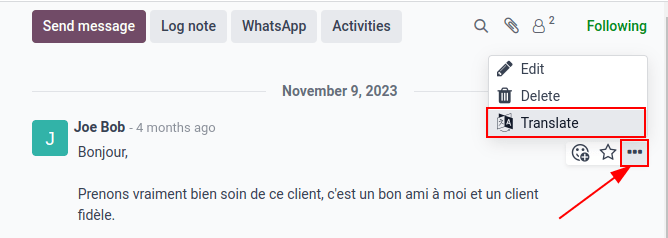
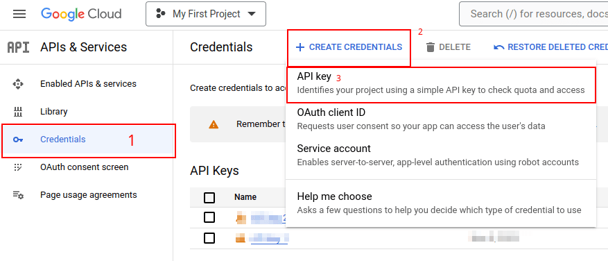
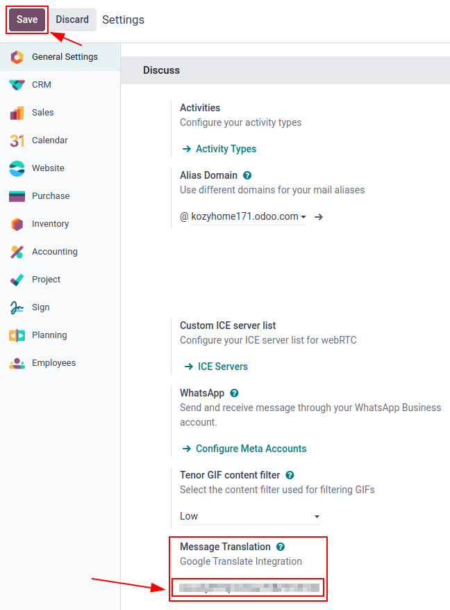

================
Google Translate
================

Google translate can be used to translate user generated text in the Odoo chatter. To translate a
user's text from another language click the *three dot* menu to the right of the chatter. Then
select :guilabel:`Translate`. The language will translate to the *language* set on the user's
preferences.

Integration is simple with some configuration on Google's Developer Console and copy and pasting an
:guilabel:`API key` into Odoo.

Google API Console
==================

A majority of the setup for integrating Google Translate into Odoo is done with Google. Once the
following processes are complete an :guilabel:`API key` will be created to input in Odoo.

.. seealso::
   `Google Translate setup on Google <https://cloud.google.com/translate/docs/setup>`_

Create a new project
--------------------

To get started, go to the `Google API Console <https://console.developers.google.com>`_. Log in with
the *Google Workspace* account if there is one, otherwise log in with a personal Gmail account (this
should match the email address that has billing attached to it).

After that, click on :guilabel:`Create Project`, located on the far right of the :guilabel:`OAuth
consent screen`. If a project has already been created in this account, then the :guilabel:`New
Project` option will be located on the top right under the :guilabel:`Select a project` drop-down
menu.

.. tip::
   If the Google Developer Console has existing projects, click the drop-down menu next to the
   :guilabel:`Google Cloud` icon and a pop-up will appear. Next, click :guilabel:`New Project` in
   the top right of the pop-up.

On the :menuselection:`New Project` screen, rename the :guilabel:`Project name` to `Odoo` and
browse for the :guilabel:`Location`. Set the :guilabel:`Location` as the *Google Workspace
organization*. If a personal Gmail account is being used, then leave the :guilabel:`Location` as
:guilabel:`No Organization`.

.. image:: translate/new-project.png
   :align: center
   :alt: Project Name and Location for Google OAuth.

Click on :guilabel:`Create` to finish this step.

API Library
-----------

Next the :guilabel:`Cloud Translation API` needs to be installed on this newly created project.
Search the term `Cloud Translation API` and click into the result. This should be a *Google
Enterprise API* labeled `Cloud Translation API`. Click :guilabel:`Enable` to install the library on
this project.

.. important::
   Using the Google Translate API requires a current billing account with `Google
   <https://https://myaccount.google.com/>`_.

Once a billing account is setup with Google and the library is enabled, click :guilabel:`Manage` to
finish configuration on the API.

Create Credentials
------------------

Now that the project is set up and library is enable, credentials should be created. These include
the *Client ID* and *Client Secret*. First, click on :guilabel:`Credentials` in the left sidebar
menu.

Then, click on :guilabel:`Create Credentials` in the top menu and select :guilabel:`API key` from
the dropdown menu.

Copy the :guilabel:`API key` for use in the next section.

.. admonition:: Restrict the API Key (Optional)
   For security purposes, the usage of the API key can be restricted for security purposes. Go to
   the :guilabel:`API restrictions` section by clicking on the :guilabel:`API key`. Here an API
   application and whether APIs call call the key. For the Google Translate API, restrict it to only
   allow requests from the configured database and the Google Translate API.

.. important::
   - Save the API Key: copy the API key and securely store it.
   - Do not share it publicly or expose it in client-side code.

Odoo set up
===========

To access the integration in Odoo, navigate to the :menuselection:`Settings app --> Discuss section
--> Message Translation`. Enter the :guilabel:`API key` into the field labeled :guilabel:`Paste your
API key`. :guilabel:`Save` the settings and Google translate can be used in any chatter throughout
the database.

